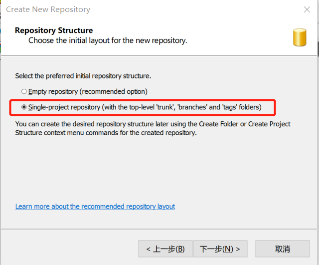
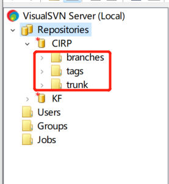
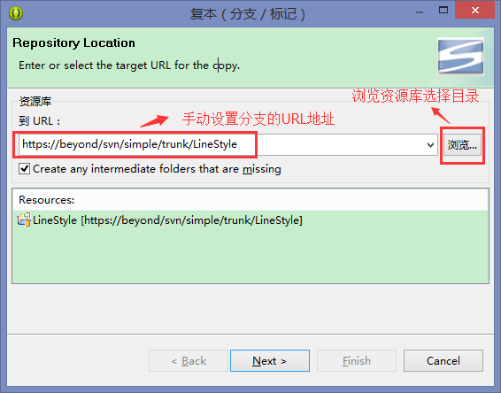
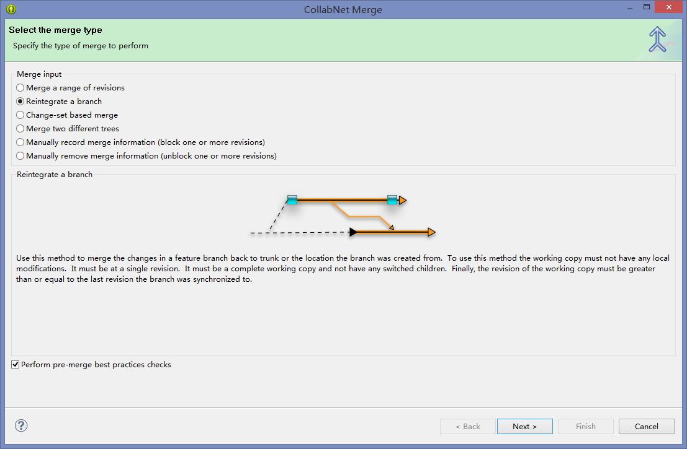
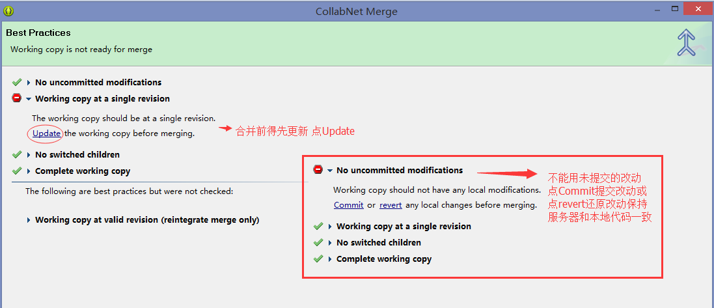
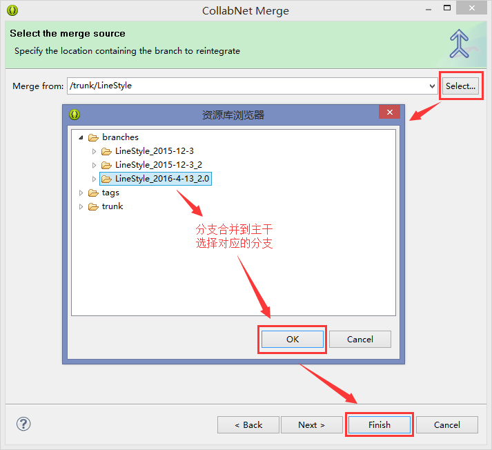

## 一、前言

​	对于svn的运用也有一定的时间，但是之前的使用一直停留在没有分支的前提下，在svn服务器创建项目时，就是选择了Empty repository(当然后续也完全可以自己建立分支，但这种意识不强)，所有的代码、bug更新迭代都在主分支上，为什么要建立分支？考虑以下情况：

```txt
	项目开发一个迭代之后，在开发一个迭代之前，一般都是需要给项目设置分支，独立保存上一个版本的代码。这样有什么好处呢？比如说：开始下一个迭代，开发到一半的时候，发现上一个版本有一个紧急BUG需要立即发包修复，这个时候就可以在上一个分支上修改即可，就不需要回撤当前的代码了！
```

## 二、分支建立以及与主分支merge

### 1、建立仓库

在svn服务器创建仓库的时候，就选择如下的情形：



那最终在svn服务器上就会有3个文件夹：



这里做出以下解释：

- branch是分支的意思，这里是复数，也就是可以创建很多的分支，正常在开发中，一个人一个分支，处理bug有bug分支，最后交给主分支merge
- trunk是主分支，一般又项目负责人来负责
- tags是项目里程碑节点

将所需要的项目托管到svn主分支即可。

### 2、建立分支

右键项目 —> Team —> Branch/Tag...（分支/标记...） 



这里选择想要的分支路径，设置URL两种方法:1.手动设置分支的svn的url地址 2.浏览资源库选择对应的目录。

这样就可以创建好分支。

切换分支：右键项目 —> Team —> 切换(S)...（Switch to another Branch/Tag/Revision...）

## 3、分支合并

右键项目 —> Team —> 合并(M)...（Merge...）







next     ok

合并前一定要先update、commit，保证不会out of day，并将本地的修改保存到repository ,branch和trunk并行开发的过程中，要经常同步，将trunk的修改合并到branch，合并时选择"Merge a range of revision"branch最后合并回trunk时，merge type选择"Reintegrate a branch"

　

